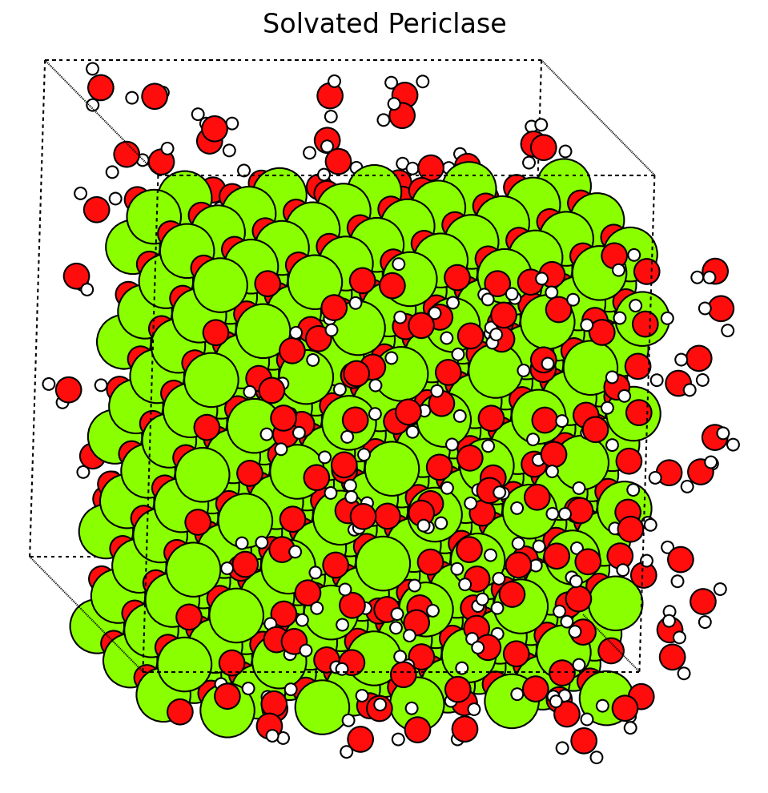

Quick Start
===========

Pack water molecules into atomic systems for molecular simulations. High-performance, O(1) collision detection using spatial hashing.

Installation
------------

.. code-block:: bash

   pip install water-packer

For `hyobj` support:

.. code-block:: bash

   pip install "water-packer[hyobj]"

Basic Usage
-----------

The easiest way to get started is by using `molecular-builder` to create your initial structures and then packing water with the native packer.

.. code-block:: python

   from water_packer import WaterPacker
   from molecular_builder import create_bulk_crystal

   # Create a MgO slab
   mgo = create_bulk_crystal("periclase", [15.0, 15.0, 15.0])

   # Create packer and pack water
   packer = WaterPacker(
       water_density=1.0,  # target density in g/cm³
       pairwise_distances={('O', 'Mg'): 2.0},
       seed=42,
   )

   result = packer.pack(mgo)
   print(f"Added {(len(result) - len(mgo))//3} water molecules")

Features
--------

* **Multiple input formats**: ASE Atoms, hyobj PeriodicSystem, or raw arrays.
* **Species-specific distances**: Different minimum distances per atom pair.
* **Automatic density calculation**: Computes number of waters from target density.
* **Volume-aware packing**: Accounts for substrate exclusion volume via Monte Carlo probes.
* **Physics Safeguards**: Warns user if requested density exceeds physical packing limits.
* **Hybrid Relaxation**: Supports optional MC/minimization steps for fitting water into tight surface features.

API Overview
------------

WaterPacker
~~~~~~~~~~~

.. code-block:: python

   WaterPacker(
       min_distance=2.0,        # Default minimum distance (Å)
       pairwise_distances=None, # Species-specific: {('O', 'Mg'): 2.0}
       water_density=1.0,       # Target density (g/cm³)
       seed=None,               # Random seed
   )

Convenience Function
~~~~~~~~~~~~~~~~~~~~

.. code-block:: python

   from water_packer import pack_water

   # One-liner for simple packing
   result = pack_water(system, n_waters=10, water_density=1.0)
